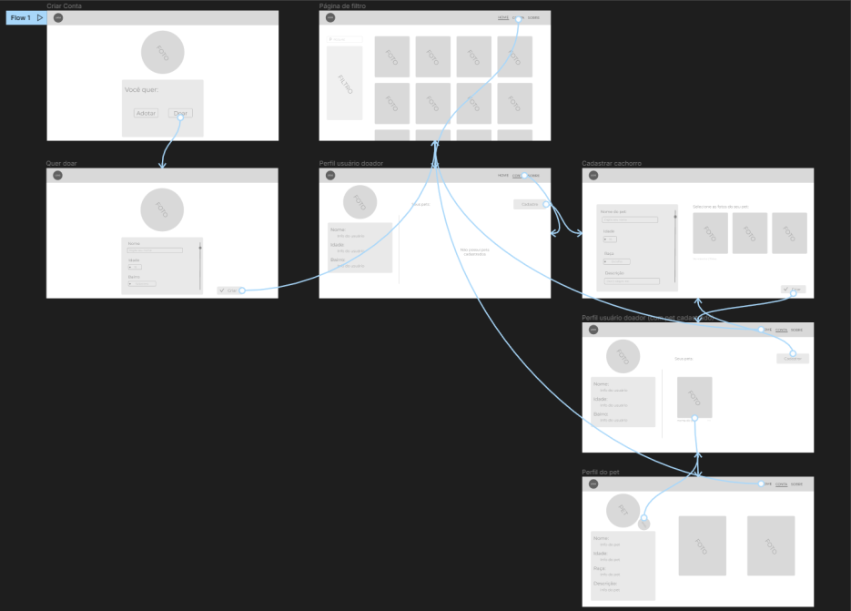
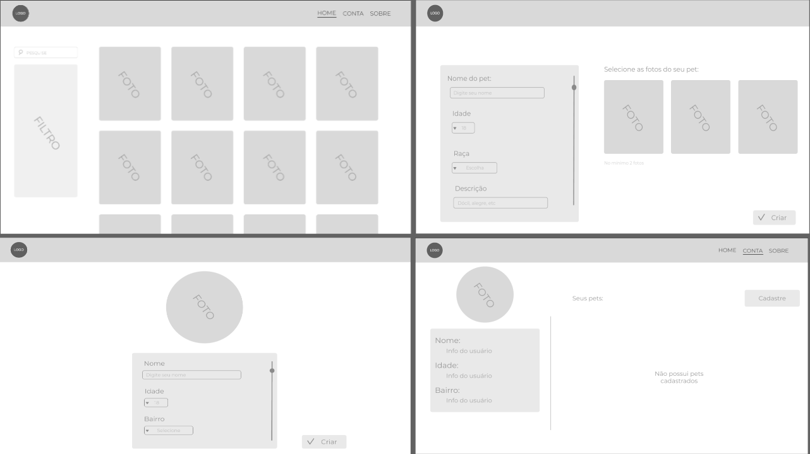

# Adote Sua Patinha
Escreva um ou dois  parágrafo resumindo o objetivo do seu projeto.

# Informações do Projeto
`Projeto Pet Tutor.`  

Projeto originado na PUC Minas no Curso de Ciências da computaçao

## Alunos integrantes da equipe

* Ana Carolina Costa Coimbra
* Gabriel Augusto de Souza e Silva Ferreira
* José Carlos Ribeiro Minelli
* Laura Caetano Costa
* Lucas Lopes Melo Fonseca

## Professores responsáveis

* Rommel Vieira Carneiro
* Carlos Augusto Paiva da Silva Martins
* Leonardo Vilela Cardoso

# Introdução

## Problema

Procura de lar para pets abandonados e conexão com possiveis tutores.
Procura de animais para adoção e conexão com doadores ( ONGs, ou animais sem um lar)
Falta de conhecimento sobre como adotar um animal abandonado ou como ajudar a encontrar um lar para o animal.

## Objetivos

Desenvolver um software que possa conectar pessoas a procura de um novo 
pet a animais que precisam de um lar, alem de ajudar a encontrar novos lares para animais resgatados

## Justificativa

A intenção do projeto é causar o encontro entre pessoas que querem adotar um pet e pets que precisam de um lar,
dessa maneira resolvendo a dor de pessoas que sofrem dois problemas diferentes, sendo que uma tem a solução da outra. 
Basta haver a conexão, o que é o mais complexo e dificil de acontecer de acordo com nossas pesquisas, por isso o
desenvolvimento do software é necessário

## Público-Alvo

O projeto é voltado tanto para ONGs de animas, quanto para pessoas comuns com o desejo de adotar um Pet.
A area de influencia do projeto é baseada em Veterinarios e pessoas voltadas para o bem estar dos animais
tanto quanto Influencer digitais que possam utilizar do nosso software para solucionar seu problema.
A abrangência do Público-Alvo decorre do fato de que o projeto atinge a qualquer pessoa que se vê na situação
de adotar/ajudar um animal sem lar.

# Especificações do Projeto

## Personas, Empatia e Proposta de Valor

## Histórias de Usuários

## Requisitos

### Requisitos Funcionais

### Requisitos não Funcionais

## Restrições

# Projeto de Interface

> Todas essas interfaces foram elaboradas de forma a atender aos requisitos funcionais identificados durante o processo de análise da solução. Foram levados em consideração princípios de usabilidade e integração, garantindo que as interfaces sejam eficientes e intuitivas, de forma a fornecer uma solução completa e eficaz para os usuários.

## User Flow

> 

> Mapa do UserFlow principal do projeto (pode sofrer pequenas alterações ao longo do desenvolvimento).

## Wireframes

> 

> Aqui tem o wireframe da página principal, cadastro de pet, cadastro de pessoa e perfil respectivamente.

# Metodologia

O grupo utilizou o metodo moderno de desenvolmimento de projetos baseado em estudos de Design Thinking
para melhor compreensãoda problemática e dividir e trabalhar de maneira ordenada e eficiente, com uma divisão 
de trabalho bem estruturada e coesa.

## Divisão de Papéis

Todos os membros do grupo tem voz ativa igual, sendo as etapas dividas para cada um dentro de consensos baseados
na proficiência de cada um e suas preferencias. A partir da divisão cada membro se torna responsável e mandante por sua parte
o que não impede de ser ajudado se necessário. Essa divisão tambem é com base nos estudos de Design Thinking e avaliação de perfil
feita no começo do projeto. Como inicio do projeto, decidimos dividir para entrega da Sprint 1 da seguine maneira:

* Ana Carolina Costa Coimbra: Slide para apresentação do projeto no dia 16/04
* Gabriel Augusto de Souza e Silva Ferreira: Relatórios GitHub, Organização da Apresentação
* José Carlos Ribeiro Minelli: Relatórios GitHub
* Laura Caetano Costa: Entrega do Miro e Relatórios GitHub, Organização da Apresentação
* Lucas Lopes Melo Fonseca: Relatórios GitHub, Organização da Apresentação

## Ferramentas

| Ambiente  | Plataforma              |Link de Acesso |
|-----------|-------------------------|---------------|
|Processo de Design Thinkgin  | Miro |(https://miro.com/app/board/uXjVMYDTGwM=) | 
|Repositório de código | GitHub |(https://github.com/ICEI-PUC-Minas-PMGCC-TI/ti-1-pmg-cc-m-20231-tiaw-pets/)| 
|Protótipo Interativo | Figma | https://www.figma.com/file/WkTkGR3MRwUpBdM1Mjb0vE/Untitled?node-id=5-145&t=6c4zrA328DnhKQXt-0 | 
|Canais de comunicacao e compartilhamento de dados| WhatsApp e Discord |
